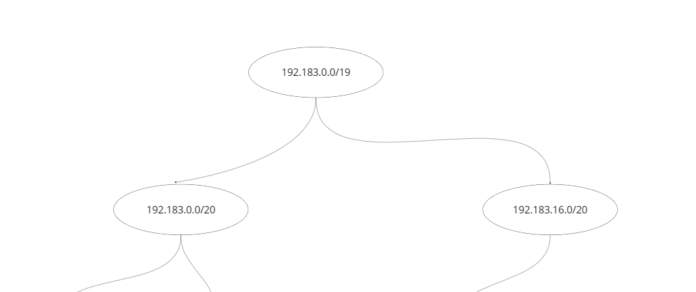
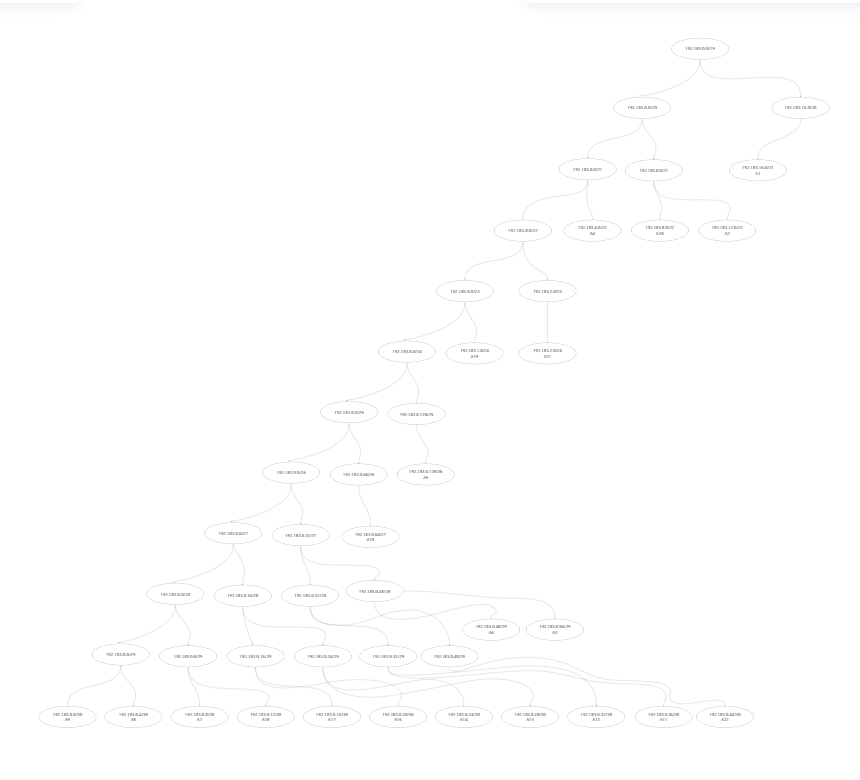
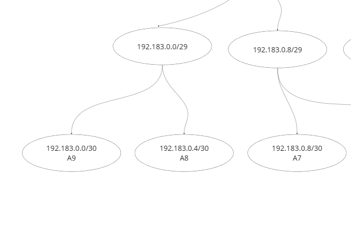
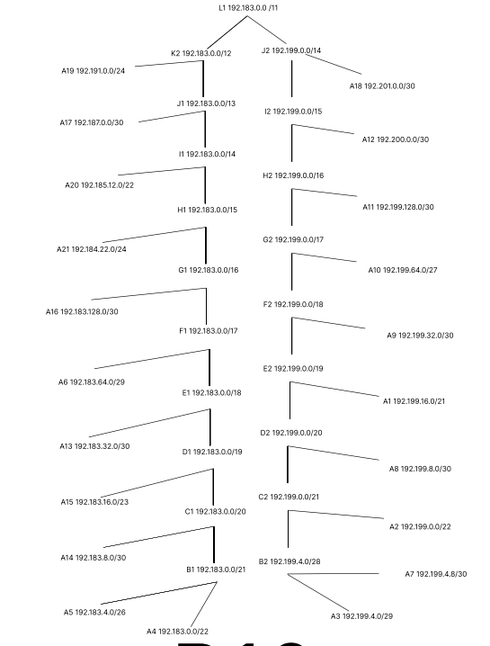

# Jarkom-Modul-4-B10-2023

### Nama Anggota B10
 <table>
 	<tr>
 		<td> Nama </td>
 		<td> NRP </td>
 	</tr>
 	<tr>
 		<td> Yusuf Hasan Nazila </td>
 		<td> 5025211225</td>
 	</tr>
	 <tr>
		 <td> Farhan Dwi Putra </td>
 		<td> 5025211093</td>
	 </tr>
 </table>

## Tree IP VLSM
Sebelum Pembagian IP VLSM maka terlebih dahulu membuat tree agar mempermudah untuk pembagian IP.

 
Pertama kami mencari /19 karena paling besar atau bisa dibilang total dari seluruhnya. Mengapa diambil /19 karena total jumlah IP adalah 4255 tanpa NAT - Aura. Jadi ambil diatasnya karena untuk /20 tidak cukup dengan 4096 adresses. Setelah itu, kami menghabiskan children bagian kiri 

        
Setelah bagian kiri habis sampai /30 paling kecil. Namun tidak ditambah IP berbeda dengan children bagian kanan

 
Children bagian kanan akan ditambah dengan /30 jika /30 adalah children. Contoh
<table>
 	<tr>
 		<td> Awal </td>
        <td> Netmask </td>
 		<td> Akhir </td>
 	</tr>
 	<tr>
 		<td> 192.183.0.0 </td>
 		<td> /30</td>
        <td> 192.183.0.4</td>
 	</tr>
</table>

 ## Rute VLSM
 Kami membagi rute menjadi 21 A dan agar mempermudah mengingatnya kami membuat mengular A1 sampai A20. 
 
 

 Setelah kami bagi seperti itu kami membuat penggabungan CIDR 

 ## Penggabungan CIDR
### Penggabungan Pertama

<table>
 	<tr>
 		<td> Subnet Baru </td>
 		<td> Subnet Gabungan </td>
 	</tr>
 	<tr>
 		<td> B1 </td>
 		<td> A4 dan A5</td>
 	</tr>
	 <tr>
		 <td> B2 </td>
 		<td> A3 dan A7</td>
	 </tr>
</table>

### Penggabungan Kedua

<table>
 	<tr>
 		<td> Subnet Baru </td>
 		<td> Subnet Gabungan </td>
 	</tr>
 	<tr>
 		<td> C1 </td>
 		<td> B1 dan A14</td>
 	</tr>
	 <tr>
		 <td> C2 </td>
 		<td> B2 dan A2</td>
	 </tr>
</table>

### Penggabungan Ketiga

<table>
 	<tr>
 		<td> Subnet Baru </td>
 		<td> Subnet Gabungan </td>
 	</tr>
 	<tr>
 		<td> D1 </td>
 		<td> C1 dan A15</td>
 	</tr>
	 <tr>
		 <td> D2 </td>
 		<td> C2 dan A8</td>
	 </tr>
</table>

### Penggabungan Keempat

<table>
 	<tr>
 		<td> Subnet Baru </td>
 		<td> Subnet Gabungan </td>
 	</tr>
 	<tr>
 		<td> E1 </td>
 		<td> D1 dan A13</td>
 	</tr>
	 <tr>
		 <td> E2 </td>
 		<td> D2 dan A1</td>
	 </tr>
</table>

### Penggabungan Kelima

<table>
 	<tr>
 		<td> Subnet Baru </td>
 		<td> Subnet Gabungan </td>
 	</tr>
 	<tr>
 		<td> F1 </td>
 		<td> E1 dan A13</td>
 	</tr>
	 <tr>
		 <td> F2 </td>
 		<td> E2 dan A1</td>
	 </tr>
</table>

### Penggabungan Keenam

<table>
 	<tr>
 		<td> Subnet Baru </td>
 		<td> Subnet Gabungan </td>
 	</tr>
 	<tr>
 		<td> G1 </td>
 		<td> F1 dan A16</td>
 	</tr>
	 <tr>
		 <td> G2 </td>
 		<td> F2 dan A10</td>
	 </tr>
</table>

### Penggabungan Ketujuh

<table>
 	<tr>
 		<td> Subnet Baru </td>
 		<td> Subnet Gabungan </td>
 	</tr>
 	<tr>
 		<td> H1 </td>
 		<td> G1 dan A21</td>
 	</tr>
	 <tr>
		 <td> H2 </td>
 		<td> G2 dan A11</td>
	 </tr>
</table>

### Penggabungan Kedelapan

<table>
 	<tr>
 		<td> Subnet Baru </td>
 		<td> Subnet Gabungan </td>
 	</tr>
 	<tr>
 		<td> I1 </td>
 		<td> H1 dan A20</td>
 	</tr>
	 <tr>
		 <td> I2 </td>
 		<td> H2 dan A12</td>
	 </tr>
</table>

### Penggabungan Kesimbilan

<table>
 	<tr>
 		<td> Subnet Baru </td>
 		<td> Subnet Gabungan </td>
 	</tr>
 	<tr>
 		<td> J1 </td>
 		<td> I1 dan A17</td>
 	</tr>
	 <tr>
		 <td> J2 </td>
 		<td> I2 dan A18</td>
	 </tr>
</table>

### Penggabungan Kesepuluh

<table>
 	<tr>
 		<td> Subnet Baru </td>
 		<td> Subnet Gabungan </td>
 	</tr>
 	<tr>
 		<td> K2 </td>
 		<td> J1 dan A19</td>
 	</tr>
</table>

### Penggabungan Kesebelas

<table>
 	<tr>
 		<td> Subnet Baru </td>
 		<td> Subnet Gabungan </td>
 	</tr>
 	<tr>
 		<td> L2 </td>
 		<td> J2 dan K2</td>
 	</tr>
</table>

## Pembagian IP CIDR
<table>
    <thead>
        <tr>
            <th>Subnet</th>
            <th>Network ID</th>
            <th>Netmask</th>
            <th>Broadcast</th>
        </tr>
    </thead>
    <tbody>
        <tr>
            <td>A1</td>
            <td>192.199.16.0</td>
            <td>255.255.248.0</td>
            <td>192.199.23.255</td>
        </tr>
        <tr>
            <td>A2</td>
            <td>192.199.0.0</td>
            <td>255.255.252.0</td>
            <td>192.199.3.255</td>
        </tr>
        <tr>
            <td>A3</td>
            <td>192.199.4.0</td>
            <td>255.255.255.248</td>
            <td>192.199.4.7</td>
        </tr>
        <tr>
            <td>A4</td>
            <td>192.183.0.0</td>
            <td>255.255.252.0</td>
            <td>192.183.3.255</td>
        </tr>
        <tr>
            <td>A5</td>
            <td>192.183.4.0</td>
            <td>255.255.255.192</td>
            <td>192.183.4.63</td>
        </tr>
        <tr>
            <td>A6</td>
            <td>192.183.64.0</td>
            <td>255.255.255.248</td>
            <td>192.183.64.7</td>
        </tr>
        <tr>
            <td>A7</td>
            <td>192.199.4.8</td>
            <td>255.255.255.252</td>
            <td>192.199.4.11</td>
        </tr>
        <tr>
            <td>A8</td>
            <td>192.199.8.0</td>
            <td>255.255.255.252</td>
            <td>192.199.8.3</td>
        </tr>
        <tr>
            <td>A9</td>
            <td>192.199.32.0</td>
            <td>255.255.255.252</td>
            <td>192.199.32.3</td>
        </tr>
        <tr>
            <td>A10</td>
            <td>192.199.64.0</td>
            <td>255.255.255.224</td>
            <td>192.199.64.31</td>
        </tr>
        <tr>
            <td>A11</td>
            <td>192.199.128.0</td>
            <td>255.255.255.252</td>
            <td>192.199.128.3</td>
        </tr>
        <tr>
            <td>A12</td>
            <td>192.200.0.0</td>
            <td>255.255.255.252</td>
            <td>192.200.0.3</td>
        </tr>
        <tr>
            <td>A13</td>
            <td>192.183.32.0</td>
            <td>255.255.255.252</td>
            <td>192.183.32.3</td>
        </tr>
        <tr>
            <td>A14</td>
            <td>192.183.8.0</td>
            <td>255.255.255.252</td>
            <td>192.183.8.3</td>
        </tr>
        <tr>
            <td>A15</td>
            <td>192.183.16.0</td>
            <td>255.255.255.128</td>
            <td>192.183.16.127</td>
        </tr>
        <tr>
            <td>A16</td>
            <td>192.183.128.0</td>
            <td>255.255.255.252</td>
            <td>192.183.128.3</td>
        </tr>
        <tr>
            <td>A17</td>
            <td>192.187.0.0</td>
            <td>255.255.255.252</td>
            <td>192.187.0.3</td>
        </tr>
        <tr>
            <td>A18</td>
            <td>192.201.0.0</td>
            <td>255.255.255.252</td>
            <td>192.201.0.3</td>
        </tr>
        <tr>
            <td>A19</td>
            <td>192.191.0.0</td>
            <td>255.255.255.0</td>
            <td>192.191.0.255</td>
        </tr>
        <tr>
            <td>A20</td>
            <td>192.185.12.0</td>
            <td>255.255.252.0</td>
            <td>192.185.15.255</td>
        </tr>
	    <tr>
            <td>A21</td>
            <td>192.184.22.0</td>
            <td>255.255.255.0</td>
            <td>192.184.22.255</td>
        </tr>
	         <tr>
            <td>B1</td>
            <td>192.183.0.0</td>
            <td>255.255.248.0</td>
            <td>192.183.7.255</td>
        </tr>
        <tr>
            <td>B2</td>
            <td>192.199.4.0</td>
            <td>255.255.255.240</td>
            <td>192.199.4.15</td>
        </tr>
        <tr>
            <td>C1</td>
            <td>192.183.0.0</td>
            <td>255.255.240.0</td>
            <td>192.183.15.255</td>
        </tr>
        <tr>
            <td>C2</td>
            <td>192.199.0.0</td>
            <td>255.255.248.0</td>
            <td>192.199.7.255</td>
        </tr>
        <tr>
            <td>D1</td>
            <td>192.183.0.0</td>
            <td>255.255.224.0</td>
            <td>192.183.31.255</td>
        </tr>
        <tr>
            <td>D2</td>
            <td>192.199.0.0</td>
            <td>255.255.240.0</td>
            <td>192.199.15.255</td>
        </tr>
        <tr>
            <td>E1</td>
            <td>192.183.0.0</td>
            <td>255.255.192.0</td>
            <td>192.183.63.255</td>
        </tr>
        <tr>
            <td>E2</td>
            <td>192.199.0.0</td>
            <td>255.255.224.0</td>
            <td>192.199.31.255</td>
        </tr>
        <tr>
            <td>F1</td>
            <td>192.183.0.0</td>
            <td>255.255.128.0</td>
            <td>192.183.127.255</td>
        </tr>
        <tr>
            <td>F2</td>
            <td>192.199.0.0</td>
            <td>255.255.192.0</td>
            <td>192.199.63.255</td>
        </tr>
        <tr>
            <td>G1</td>
            <td>192.183.0.0</td>
            <td>255.255.0.0</td>
            <td>192.183.255.255</td>
        </tr>
        <tr>
            <td>G2</td>
            <td>192.199.0.0</td>
            <td>255.255.128.0</td>
            <td>192.199.127.255</td>
        </tr>
        <tr>
            <td>H1</td>
            <td>192.183.0.0</td>
            <td>255.254.0.0</td>
            <td>192.183.255.255</td>
        </tr>
        <tr>
            <td>H2</td>
            <td>192.199.0.0</td>
            <td>255.255.0.0</td>
            <td>192.199.255.255</td>
        </tr>
        <tr>
            <td>I1</td>
            <td>192.183.0.0</td>
            <td>255.252.0.0</td>
            <td>192.183.255.255</td>
        </tr>
        <tr>
            <td>I2</td>
            <td>192.199.0.0</td>
            <td>255.254.0.0</td>
            <td>192.199.255.255</td>
        </tr>
        <tr>
            <td>J1</td>
            <td>192.183.0.0</td>
            <td>255.248.0.0</td>
            <td>192.183.255.255</td>
        </tr>
        <tr>
            <td>J2</td>
            <td>192.199.0.0</td>
            <td>255.252.0.0</td>
            <td>192.199.255.255</td>
        </tr>
        <tr>
            <td>K1</td>
            <td>192.183.0.0</td>
            <td>255.240.0.0</td>
            <td>192.183.255.255</td>
        </tr>
        <tr>
            <td>L1</td>
            <td>192.183.0.0</td>
            <td>255.224.0.0</td>
            <td>192.183.255.255</td>
        </tr>
    </tbody>
</table>

## Tree CIDR
Kami membuat tree dengan penjelasan 
1. Kami membuat parent awal 192.183.0.0/11 itu IP paling awal jika di tabel adalah L1 paling bawah. Jadi pembacaannya dari bawah ke atas
2. Setelah parent terbuat ip akan diturunkan pada kedua anaknya dengan awal ip sama tetapi Netmask yang berbeda
   
3. Jika sudah diturunkan ipnya, dapat dibandingan. Jika netmasknya lebih besar ( /12 > /14 ) maka ip bagian /14 akan (192.183.0.0/14) + (0.0.16.0) ditambah SubnetMask /12

    

 

